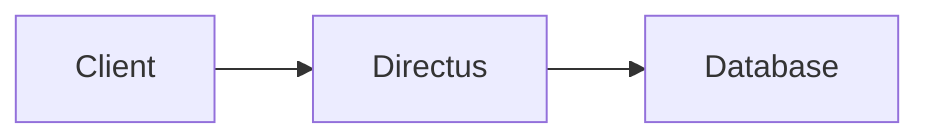

# AGENTS.md

This file provides guidance to coding agents working in this repository.

## Project Overview

Directus documentation site built with Nuxt 4 and `@nuxt/content`. Markdown files in `/content` are rendered as pages. Deployed to Vercel on merge to main, served at `https://directus.com/docs` (note the `/docs` base URL in `nuxt.config.ts`).

## Commands

```bash
pnpm install        # Install dependencies (requires Node.js >=22.18, pnpm 10.29.2)
pnpm dev            # Dev server at http://localhost:3000/docs
pnpm build          # Production build
pnpm generate       # Static site generation (used for Vercel deploy)
pnpm preview        # Preview production build locally
pnpm test:mermaid   # Mermaid component and export tests
```

`pnpm dev` fails with `Invalid URL` unless `DIRECTUS_URL` is set, because the Nuxt server passes it to `createDirectus()` during render. Copy any missing environment variables from `.env.example` to `.env` before the first run. For content-only work, `DIRECTUS_URL` is the sole required value; the remaining variables emit warnings and disable search, analytics, and the assistant.

Component tests use Vitest and Nuxt Test Utils. Linting is via `@nuxt/eslint` (run through Nuxt's built-in integration).

## Architecture

### Content System

All documentation lives in `/content` as Markdown with YAML frontmatter. Two collections defined in `content.config.ts`:
- `landing` — just `index.md`
- `content` — everything else, with schema requiring `title` (and optional `description`, `authors`, `technologies`, `links`, `icon`)

Reusable content fragments live in `/content/_partials/` and are included via the `Partial` component.

### Routing

- `app/pages/[...slug].vue` — catch-all for content pages
- `app/pages/api/[tag].vue` — OpenAPI-generated API reference (spec comes from the `@directus/openapi` package via `scripts/generate-api-reference.ts`; fixes to endpoint docs belong in the [directus/openapi](https://github.com/directus/openapi) repo)
- `app/pages/tutorials/` — tutorial section with nested routes

### Custom Markdown Components

Common Vue components in `app/components/content/` are available in markdown via MDC syntax:

| Component | MDC Usage |
|---|---|
| `TwoUp` | `::two-up` |
| `ShinyGrid` | `::shiny-grid` |
| `ShinyCard` | `:::shiny-card` |
| `Example` | `:::example` |
| `Faq` | `:::faq` |
| `Chat` | `:::chat` |
| `Mermaid` | `::mermaid{title="Diagram title" filename="diagram-filename"}` |
| `VideoEmbed` | `:video-embed{video-id="..."}` |
| `DocCliSnippet` | `:doc-cli-snippet{command="..."}` |
| `Partial` | `:partial{content="path/to/partial"}` |
| `CtaCloud` | `:cta-cloud` |
| `ProductLink` | `:product-link` |
| `ProseImg` | Overrides default `` in prose |

Put Mermaid source in a fenced `mermaid` block inside the component. The component renders a themed, interactive diagram with zoom, pan, reset, and self-contained PNG and SVG downloads.

````mdc
::mermaid{title="Directus request flow" filename="directus-request-flow"}

::
````

### Key Config Files

- `nuxt.config.ts` — modules, prerendering rules, ESLint config, base URL
- `content.config.ts` — content collection schemas (Zod)
- `app/app.config.ts` — navigation structure, UI theme (purple primary), footer links
- `.env.example` — required env vars: Algolia, Directus URL, GTM, Nuxt UI Pro license, PostHog

### Modules & Integrations

Nuxt modules: `@nuxt/ui-pro`, `@nuxt/content`, `@nuxtjs/robots`, `@nuxtjs/sitemap`, `@nuxtjs/algolia` (conditional on env vars), `@vueuse/nuxt`, `@nuxt/scripts`. Custom PostHog module in `/modules/posthog/`.

## Code Style

- Tabs for indentation (spaces for `.md` and `.yml` — see `.editorconfig`)
- Semicolons required
- ESLint stylistic rules enforced via `@nuxt/eslint` config in `nuxt.config.ts`
- TypeScript throughout

## Tone of Voice for Documentation Content

Matching the existing tone is mission-critical. All new or edited content in `/content` must follow these rules:

### Voice & Person
- Always address the reader as "you" (second person)
- Use active voice — "Create a collection" not "A collection should be created"
- Use imperative mood for instructions — "Run the following command" not "You might want to run"
- Be direct and confident. No hedging ("you might want to", "you could consider") — just tell the reader what to do

### Formality
- Semi-formal: professional and authoritative, but not stiff or corporate
- Assume the reader is a competent developer — don't over-explain basic concepts
- Contractions are acceptable in explanatory prose ("you'll", "don't", "can't") but keep step-by-step instructions slightly more formal ("you will need" over "you'll need")

### Sentence Structure
- Keep sentences short to medium length — concise and scannable
- Prefer bullet points and numbered lists to break down processes
- Lead with context ("why") before diving into instructions ("how")
- One idea per sentence. Break complex thoughts into smaller pieces

### Technical Writing Conventions
- Inline code for: `collection_names`, `field_names`, env vars, API endpoints, file paths
- **Bold** for UI elements ("Click **Create Field**") and key terms on first introduction
- Introduce concepts with a plain-language definition before going deeper — "Collections are database tables with additional metadata and configuration used by Directus."
- Use callout boxes for warnings and important notes, not inline ALL-CAPS or exclamation marks

### Structure
- Start guides with a "Before You Start" section listing prerequisites
- Use "Next Steps" sections to point to related content
- Use transitions like "Now that..." to connect sections
- Every explanation should tie to a concrete action or use case — minimize abstract theory

### Things to Avoid
- Filler phrases ("In order to", "It should be noted that", "As a matter of fact")
- Marketing language or hype ("powerful", "revolutionary", "seamless")
- Passive voice in instructions
- Walls of text — if a paragraph exceeds 3-4 sentences, break it up or use a list
- AI-isms ("I'd be happy to help", "Great question!", "Certainly!")
- Telltale AI writing patterns: em dashes (—) used as general-purpose punctuation, "delve", "leverage", "utilize", "straightforward", "it's worth noting", "key" as an adjective. Use normal dashes (-) or rewrite the sentence instead

## Hosting

The docs website is hosted as a nested path on the main Directus marketing website https://directus.com/docs. The rest of the Directus website is a separate repo.
